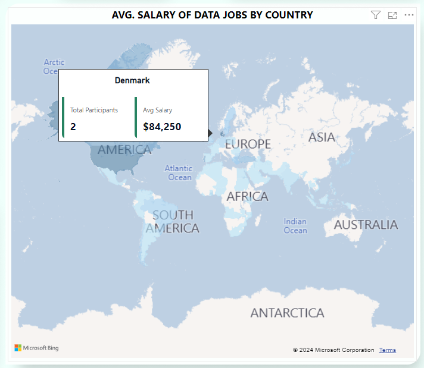

# Data-Proffessional-Survey-Data-Analysis
## by Kola Ademola
___

___
## INTRODUCTION
___
Inspiration for this project is gotten from Alex Freberg big thanks to him.!!!! For this project I used the survey data Alex Freberg collected from a survey of Data professionals.. 

## PROBLEM STATEMENT
The purpose of this analysis is just to get an insight of what data roles/jobs are like. I am interested in finding out the following from this analysis:
* Which Data role earns the most salary?
* What are satisfaction levels like in terms of, Management, Work/Life balance and Salary.
* Which country can I get the most salary as a data Professional?
* Which Industry do Data professionals work in the most & what programming language is most common?
* What do these data professionals look out for when they're searching for their next role?
* How difficult is it to break into data?

___
## DATA SOURCING
___
This is a real dataset from a survey conducted by [Alex Freberg](https://www.youtube.com/@AlexTheAnalyst).  
Here's a link to his [Youtube](https://www.youtube.com/@AlexTheAnalyst)  
Link to [Dataset](https://github.com/AlexTheAnalyst/Power-BI/blob/main/Power%20BI%20-%20Final%20Project.xlsx)
___
## SKILLS DEMONSTRATED
___
For this project I used the following tools;
* **Python -->** For Data Cleaning
* **Power BI -->** For Data transformation, Data Modelling & Visualization
  
### DATA CLEANING
The survey raw data was very dirty with many data quality issues. I first imported the dataset into a Jupyter notebook where I used Python to clean the data.  
  
I did a lot of cleaning with Python but I will just walkthrough the important parts.  
> I dropped some columns that I would'nt use in my analysis first.

___
> The salary was in a range ie (10-20k, 30-40k etc..) so I had to extract the salary values and then calculated the average salary for each response from the range given by the respondent.  

___
> The last important cleaning step was to replace all the free responses, where respondents could type anything to just **"Others"**

___
> After cleaning, I exported the cleaned data for further transformation and visualizations in Power BI.

___
### DATA TRANSFORMATION & MODELLING
___
The dataset was still in a single table, so I had to do some extra transformation in Power BI to create dimension tables out of the data. The dimension tables created were;
* **ROLES** table: This hold info on all the job roles.
* **INDUSTRIES** table: This holds info on all the job industries.
* **COUNTRIES** table: This holds info on all the countries of the participants.
* **PROGRAMMING LANGUAGES** table: This holds info on all the languages used by participants for their jobs.

I then used these to create a simple **STAR SCHEMA** with the main survey data table as the *Fact* table.  

___
## ANALYSIS & VISUALIZATIONS
___ 
This dashboard has a single report page

### [LINK TO DASHBOARD](https://app.powerbi.com/view?r=eyJrIjoiODVmMGFiM2EtYjBhNS00NzBhLThjODMtMDYyYjlkZDVhMGQwIiwidCI6ImQyMzQyMjIxLWJiM2ItNGQ1ZS04NWRmLTkyYzFlOTg0YTNlZCJ9)
___
I am interested in finding out the following from this analysis:
* Which Data role earns the most salary?

___
* What are satisfaction levels like in terms of, Management, Work/Life balance and Salary.
### SATISFACTION LEVELS
|Management|Work/Life balance|Salary|
|----------|-----------------|------|
||||
___
* Which country can I get the most salary as a data Professional?
|Ireland|Denmark|USA|
|----------|-----------------|------|
||||
___
* Which Industry do Data professionals work in the most & what programming language is most common?

___
* What do these data professionals look out for when they're searching for their next role?

___
* How difficult is it to break into data?

___

___
